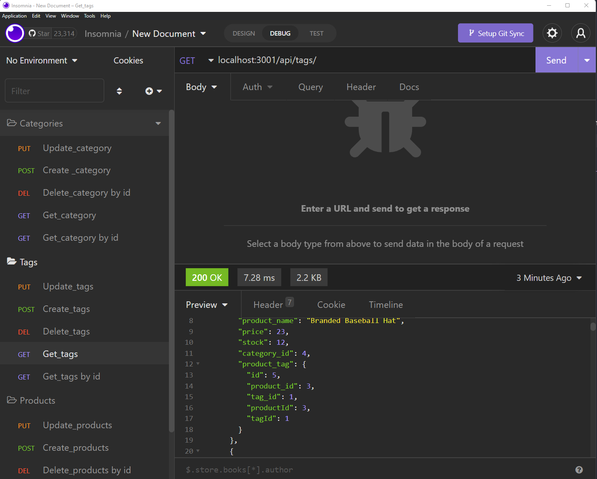

# e-comerce-back-end-orm

E-Commerce Back End - ORM (Object Relational Mapping)

## Description

This is an E-commerce Back End only (no front end) using ORM (Object Relational Mapping). The routes are tested using Insomnia since there is no front end. You can create a category, view all categories, view a single category, update a category and delete a category. The same goes for the tags and products as well. Check out the screenshots and link to demo of the app below!

## Screenshot(s)

## Link to Demo of App

[Demonstration of Ecommerce Back End](https://drive.google.com/file/d/1tjvueIiX8vkLAUO_vMdpCAHm8xOGQgrd/view)
